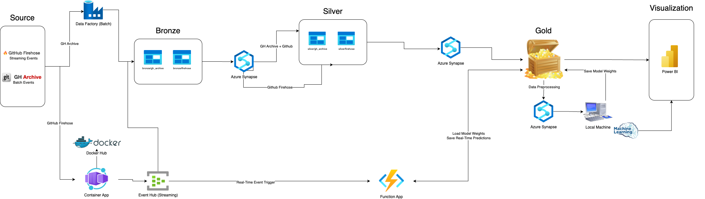

# GitHub Issue Tracker

## Objective

GitHub is the leading platform where developers collaborate and contribute to open-source and private projects. In open-source projects, developers rely on issue-tracking systems in GitHub to manage bugs, feature requests, and tasks. However, accurately predicting the time required to resolve an issue remains a challenge due to various factors, including issue complexity, contributor engagement, and repository activity. The ability to estimate issue resolution times can improve project planning and allocate resources accordingly. The goal of our project is to collect, process, and analyze GitHub issue data at a large scale to identify developer trends. Additionally, we’ve developed a predictive model to help predict resolution times of issues, enabling more informed project planning and resource allocation for open-source maintainers and contributors.

## System Architecture

## Data Ingestion

### Historical Data
Ingest compressed .gz files directly from [GH Archive](https://www.gharchive.org/) through Azure Data Factory
- 1 Hour of github events data takes up approximately 70 Mib
- Time range: 2024-03-01-0 ~ 2025-02-28-23 (1 year)

Pipeline:
1. Generate timestamps using `generate_timestamps.py`.
2. Upload it to our blob storage.
3. Look up `timestamps.json`.
4. Loop through `timestamps.json` to ingest data hourly.

### Real-Time (Streaming) Data
Ingest real-time events from (GitHub Firehose)[https://github-firehose.libraries.io/].

In the streaming pipeline, real-time GitHub events are ingested from GitHub Firehose using a Dockerized Container App, which selectively captures only issue-related events for efficiency. These filtered events are published to Azure Event Hub, which triggers an Azure Function App upon arrival. The Function App processes each event, loads the pre-trained model weights from the Gold layer, and performs real-time predictions on the incoming issue data. The prediction outputs are then written back to the Gold layer and made available for visualization in Power BI.

## Data Processing

### Bronze To Silver

### Silver To Gold

## PowerBI Dashboard

### GitHub Issue Data Analysis

### Machine Learning Analysis

